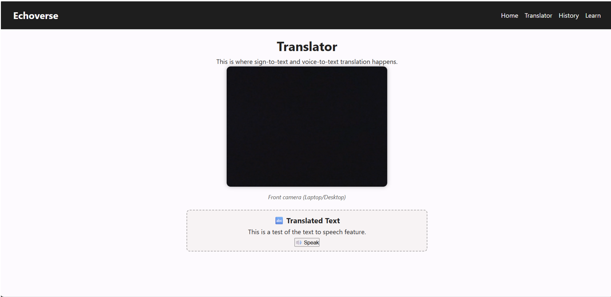
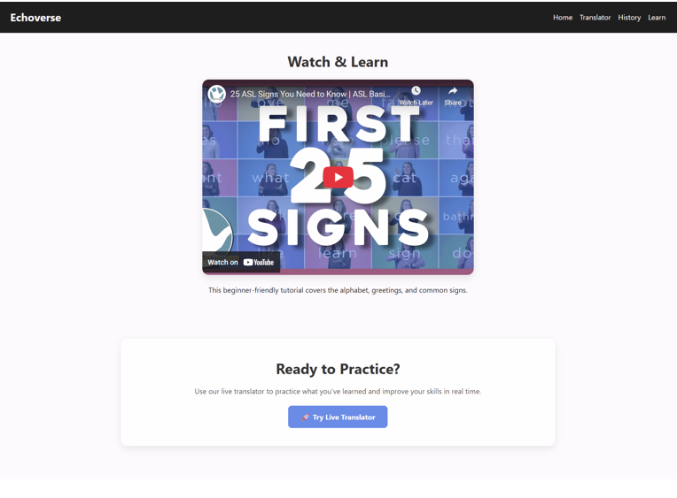
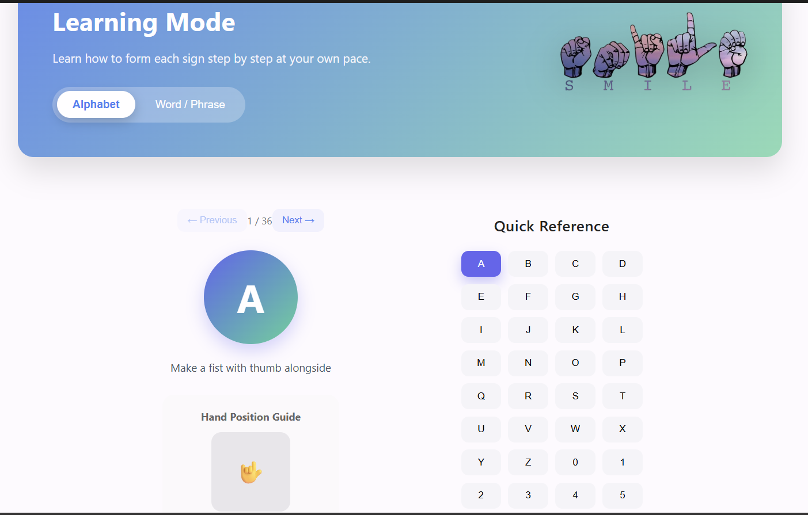

# EchoVerse - Real-Time Sign Language Translator

EchoVerse is a deep learning-driven real-time sign language translation system designed to facilitate communication between hearing-impaired individuals and non-signers. The application uses MediaPipe hand landmark detection and a CNN-LSTM architecture to recognize sign language gestures and convert them into text in real time.

## Features

* Real-time sign language gesture recognition
* CNN-LSTM based deep learning model
* MediaPipe hand landmark detection and tracking
* Text translation from recognized signs
* Learning module for practicing sign language
* Text-to-speech support
* Voice-to-text functionality
* IndexedDB storage for translated text history

## Technologies Used

### Frontend

* React.js
* HTML5
* CSS3
* JavaScript

### AI & Machine Learning

* TensorFlow
* Keras
* CNN-LSTM Architecture
* MediaPipe
* OpenCV

### Database & Storage

* IndexedDB

## Project Structure

```text
src/        - React application source code
public/     - Models and learning resources
training/   - Model training scripts
```

## Research Publication

**Deep Learning-Driven Real-Time Sign Language Translation Using Hand Landmark Sequences**
Published in *Global Perspectives on AI and Sustainable Development 2.0 (2026)*.

## Screenshots

### Home Page


### Real-Time Translator



### Learning Module





